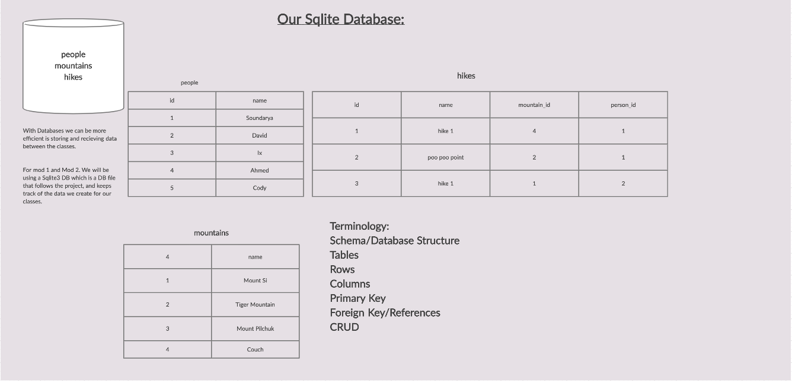

# Intro to SQL 🛢

## What is SQL?

SQL stands for Structured Query Language and is a language that allows us to:

- Store / persist information
- Manipulate that information
- We can perform CRUD (Create, Read, Update, Delete) actions

# Why do we need databases?
- Lots of data
- Ability to find hidden connections and reference and patterns
- safer in case something gets deleted
- have data persist between session of a program being run
- stored in one place very convenient
- makese sharing data easier.
- the future!!! 
- BIG DATA

## Creating Databases & Tables From the Command Line With Sqlite3

1. Create a new db `sqlite3 nature.db`
2. Create table in the terminal

```sql
CREATE TABLE mountains (id INTEGER PRIMARY KEY, name TEXT);
```

3. Or Create a .sql file

```sql
CREATE TABLE people (id INTEGER PRIMARY KEY, name TEXT);
```

4. And execute `sqlite3 nature.db < 01_create_mountains.sql`

## Creating tables in Sqlite Browser

1. Install the SQLite Browser if you haven't already [here](http://sqlitebrowser.org/)
2. Open the SQLite Browser and click 'File -> Open DataBase'
3. Choose the `music.db` file from this repo. This database is open source and maintained by Microsoft (SQL is no fun if you don't have any data)
4. Click the tab that says 'Execute SQL'. Type SQL queries in the box above. Press the play button. See the results of that query in the box below



Terminology/Notes: 
1. Schema: Going to give us a high level overview of the table and rows for our DB.
2. Table: table names are always plural.
3. Columns: we will typically always have a primary key inside of the tables. 
4. Rows: where our actual data inside of our table is
5. Foreign Keys: will always have the convention `table_name`, always reference the foreign key of a different table.
6. CRUD
  - Create ( any time we are insterting new information into the DB)
    - CREATE TABLE ...
    - INSERT INTO ...
  - Read
    - SELECT * 
    - SELECT columns ...
    - SELECT * WHERE column = 
    - ORDER BY
  - Update
    - UPDATE table ...
    - ALTER TABLE ...
  - Delete
    - DROP TABLE ...
    - DELETE * FROM WHERE ...
